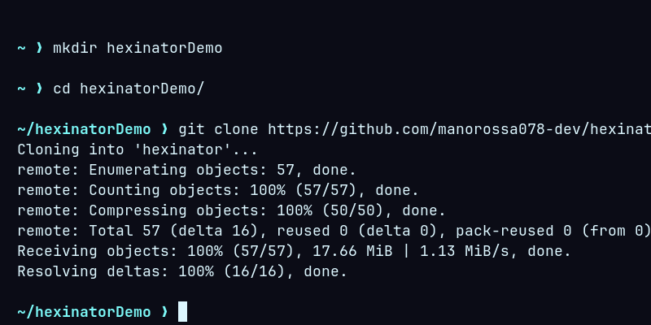
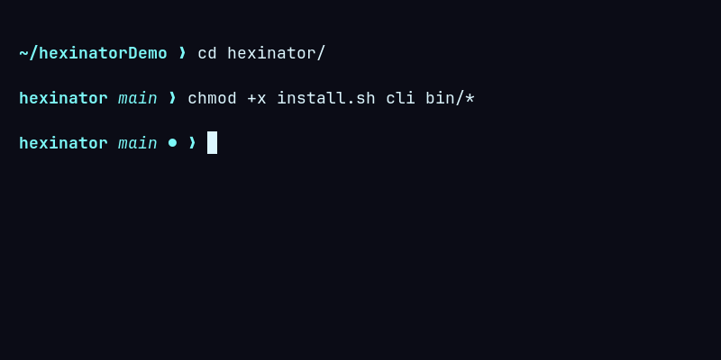
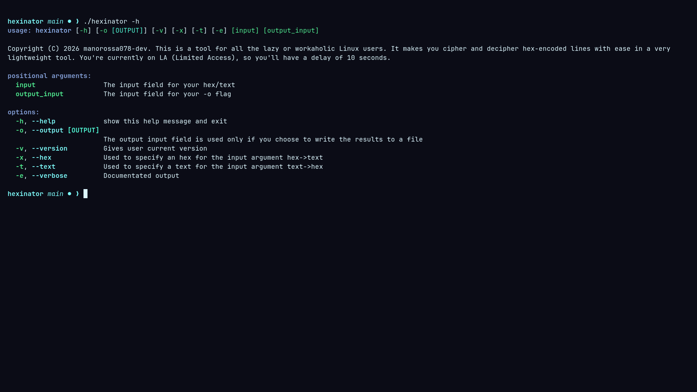

# hexinator
My first Python3 mixed bash project: are you willing to spare some time? Bored of manually deciphers / ciphers? This is the tool for you!

Cloning into hexinator:
```bash
git clone https://github.com/manorossa078-dev/hexinator.git
```


Setting it up:
```bash
chmod +x install.sh cli bin/*
./install.sh
```


Example:
```bash
./cli -h
```

